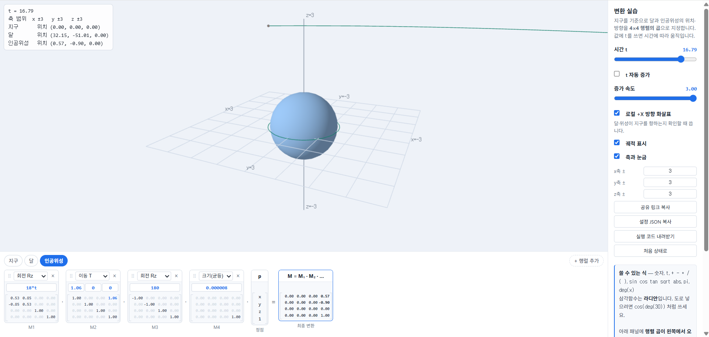
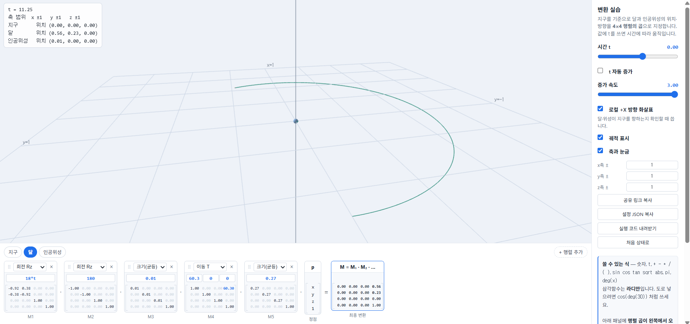
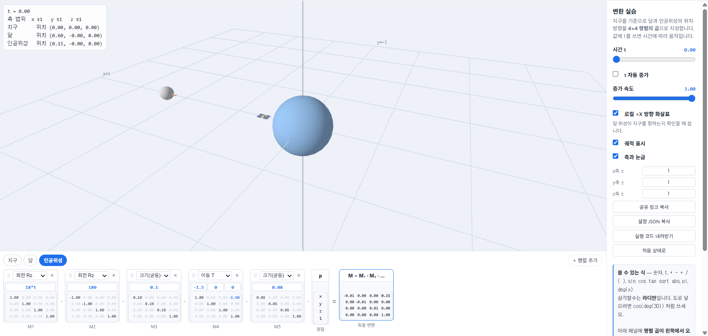

# 2주차 보고서

- 이름 : 김태민
- 저장소 : https://github.com/kimposong/cg-2026-solar/
- 실행
    - [Task 1 실행하기](https://kimposong.github.io/cg-2026-solar/week2/task1.html) 
    - [Task 2 실행하기](https://kimposong.github.io/cg-2026-solar/week2/task2.html)
    - [Task 3 실행하기](https://kimposong.github.io/cg-2026-solar/week2/task3.html)

## Task1

### 대상 인공위성
ISS

### 조사한 값

| 항목 | 실제 크기(km) | 지구중심으로부터의 거리(km) | 출처 |
| --- | --- | --- | --- |
| 지구 | 6371 | 0 | NASA Goddard Space Flight Center, "Earth Fact Sheet", https://nssdc.gsfc.nasa.gov/planetary/factsheet/earthfact.html |
| 달 | 1737 | 384400 | NASA Goddard Space Flight Center, "Moon Fact Sheet", https://nssdc.gsfc.nasa.gov/planetary/factsheet/moonfact.html |
| ISS | 0.054 | 6771 | NASA, "International Space Station Overview", https://www.nasa.gov/international-space-station/ |

### 내가 넣은 변환

```json
{
  "range": {
    "x": "3",
    "y": "3",
    "z": "3"
  },
  "objects": [
    {
      "id": "earth",
      "name": "지구",
      "color": [
        0.35,
        0.6,
        0.95
      ],
      "steps": [
        {
          "type": "Su",
          "args": [
            "1"
          ]
        }
      ]
    },
    {
      "id": "moon",
      "name": "달",
      "color": [
        0.78,
        0.78,
        0.82
      ],
      "steps": [
        {
          "type": "Rz",
          "args": [
            "18*t"
          ]
        },
        {
          "type": "T",
          "args": [
            "60.3",
            "0",
            "0"
          ]
        },
        {
          "type": "Rz",
          "args": [
            "180"
          ]
        },
        {
          "type": "Su",
          "args": [
            "0.27"
          ]
        }
      ]
    },
    {
      "id": "sat",
      "name": "인공위성",
      "color": [
        0.95,
        0.72,
        0.35
      ],
      "steps": [
        {
          "type": "Rz",
          "args": [
            "18*t"
          ]
        },
        {
          "type": "T",
          "args": [
            "1.06",
            "0",
            "0"
          ]
        },
        {
          "type": "Rz",
          "args": [
            "180"
          ]
        },
        {
          "type": "Su",
          "args": [
            "0.000008"
          ]
        }
      ]
    }
  ]
}
```

- `rz` > `t` > `rz` > `s` 순서를 채용한 이유는 처음 `rz` 로 공전을 만들고 두번째 `rz` 로 바라보는 방향을 지구로 바꾸는 방식을 채용하였습니다 `t` 의 위치는 크게 상관이 없지만 전체적인 크기를 바꾸는 `s` 는 마지막에 두어야 궤도나 위치에 영향이 가지 않기 때문에 마지막 순서로 채용하였습니다

### 질문
- 거리의 단위를 무엇으로 정했는가? 왜 그렇게 정했는가?
    - 지구 반지름의 크기(6371km)를 1로 잡고 해당 크기를 기준으로 다른 크기들의 비율을 잡았다 가장 큰 천체인 지구의 크기가 적당한 값(1) 이어야 나머지를 나타낼 때 용이 할 것 같았기 때문
- 숫자가 커서 생긴 문제가 있었는가? 있었다면 무엇인가?
    - 지구나 달의 크기나 공전 궤도에 비해 인공위성의 크기나 공전 궤도가 너무 작아 거의 보이지 않음
- 달·위성이 지구를 향하게 만든 것은 어느 변환 단계 덕분인가?
    - 두번째 `rz`의 값 180이 달&위성이 지구를 바라보게 하는 단계이다



- [task1 공유링크](https://cg.catholic.ac.kr/~mgchoi/CG/demos/d02-transform-lab.html?d=eyJyYW5nZSI6eyJ4IjoiMyIsInkiOiIzIiwieiI6IjMifSwib2JqZWN0cyI6W3siaWQiOiJlYXJ0aCIsIm5hbWUiOiLsp4DqtawiLCJjb2xvciI6WzAuMzUsMC42LDAuOTVdLCJzdGVwcyI6W3sidHlwZSI6IlN1IiwiYXJncyI6WyIxIl19XX0seyJpZCI6Im1vb24iLCJuYW1lIjoi64usIiwiY29sb3IiOlswLjc4LDAuNzgsMC44Ml0sInN0ZXBzIjpbeyJ0eXBlIjoiUnoiLCJhcmdzIjpbIjE4KnQiXX0seyJ0eXBlIjoiVCIsImFyZ3MiOlsiNjAuMyIsIjAiLCIwIl19LHsidHlwZSI6IlJ6IiwiYXJncyI6WyIxODAiXX0seyJ0eXBlIjoiU3UiLCJhcmdzIjpbIjAuMjciXX1dfSx7ImlkIjoic2F0IiwibmFtZSI6IuyduOqzteychOyEsSIsImNvbG9yIjpbMC45NSwwLjcyLDAuMzVdLCJzdGVwcyI6W3sidHlwZSI6IlJ6IiwiYXJncyI6WyIxOCp0Il19LHsidHlwZSI6IlQiLCJhcmdzIjpbIjEuMDYiLCIwIiwiMCJdfSx7InR5cGUiOiJSeiIsImFyZ3MiOlsiMTgwIl19LHsidHlwZSI6IlN1IiwiYXJncyI6WyIwLjAwMDAwOCJdfV19XX0%3D)

## task2

### 내가 넣은 변환

```json
{
  "range": {
    "x": "1",
    "y": "1",
    "z": "1"
  },
  "objects": [
    {
      "id": "earth",
      "name": "지구",
      "color": [
        0.35,
        0.6,
        0.95
      ],
      "steps": [
        {
          "type": "Su",
          "args": [
            "0.01"
          ]
        },
        {
          "type": "Su",
          "args": [
            "1"
          ]
        }
      ]
    },
    {
      "id": "moon",
      "name": "달",
      "color": [
        0.78,
        0.78,
        0.82
      ],
      "steps": [
        {
          "type": "Rz",
          "args": [
            "18*t"
          ]
        },
        {
          "type": "Rz",
          "args": [
            "180"
          ]
        },
        {
          "type": "Su",
          "args": [
            "0.01"
          ]
        },
        {
          "type": "T",
          "args": [
            "60.3",
            "0",
            "0"
          ]
        },
        {
          "type": "Su",
          "args": [
            "0.27"
          ]
        }
      ]
    },
    {
      "id": "sat",
      "name": "인공위성",
      "color": [
        0.95,
        0.72,
        0.35
      ],
      "steps": [
        {
          "type": "Rz",
          "args": [
            "18*t"
          ]
        },
        {
          "type": "Rz",
          "args": [
            "180"
          ]
        },
        {
          "type": "Su",
          "args": [
            "0.01"
          ]
        },
        {
          "type": "T",
          "args": [
            "1.06",
            "0",
            "0"
          ]
        },
        {
          "type": "Su",
          "args": [
            "0.000008"
          ]
        }
      ]
    }
  ]
}
```

- 원 비율로 만들어진 프로그램의 가장 큰 크기가 달의 `t` 의 x값 **60.3** 이기 때문에 해당 위치가 1x1x1 비율에 들어오게 하기 위해서 모든 위치 스케일을 **0.01배** 하기 위해서 스케일과 관련이 없는 `rz`값을 앞으로 몰아 놓고 원래 있던 `t`와`s` 앞에 크기 조절을 위한 새로운 `t`를 **0.01**로 삽입하였다

### 질문
- s를 얼마로 정했고 그 값을 어떻게 계산했는가?
    - **0.01** 프로그램의 값 중 가장 큰 값이 달과 지구 중심 사이의 거리 60.3 이기 때문에 해당 크기가 1x1x1 안에 여유롭게 들어가는 배율 0.01을 곱하는 것으로 정했다
- 배율 행렬을 사슬의 맨 앞에 넣은 이유는 무엇인가? 맨 뒤에 넣으면 어떻게 되는가?
    - 내 프로그램은 공전이 망가지지 않기 위해 `rz`다음 배율 `s`를 추가하였다 위치의 이유는 모든 크기 비율값을 0.01배 하기 위해서 앞에 넣는 것이다 맨뒤에 넣게 되면 `t`같은 거리 값이 이미 정해진 후에 크기 배율이 적용되어 천체의 반지름 크기만 배율이 적용되기 때문에 일괄 적용이 어렵다
- 세 물체에 같은 배율을 쓴 이유는 무엇인가?
    - 기본적으로 정해진 크기 비율을 망가트리지 않기 위해서
- 비율을 유지한 결과, 화면에서 지구와 인공위성은 어떻게 보이는가?
    - 지구의 크기가 1x1x1 안에 들어올 만큼 작아졌기 때문에 원 크기에서도 보이지 않던 인공위성이 더 작아지기 때문에 궤도 선만 보이는 정도가 되었다



- [task2 공유링크](https://cg.catholic.ac.kr/~mgchoi/CG/demos/d02-transform-lab.html?d=eyJyYW5nZSI6eyJ4IjoiMSIsInkiOiIxIiwieiI6IjEifSwib2JqZWN0cyI6W3siaWQiOiJlYXJ0aCIsIm5hbWUiOiLsp4DqtawiLCJjb2xvciI6WzAuMzUsMC42LDAuOTVdLCJzdGVwcyI6W3sidHlwZSI6IlN1IiwiYXJncyI6WyIwLjAxIl19LHsidHlwZSI6IlN1IiwiYXJncyI6WyIxIl19XX0seyJpZCI6Im1vb24iLCJuYW1lIjoi64usIiwiY29sb3IiOlswLjc4LDAuNzgsMC44Ml0sInN0ZXBzIjpbeyJ0eXBlIjoiUnoiLCJhcmdzIjpbIjE4KnQiXX0seyJ0eXBlIjoiUnoiLCJhcmdzIjpbIjE4MCJdfSx7InR5cGUiOiJTdSIsImFyZ3MiOlsiMC4wMSJdfSx7InR5cGUiOiJUIiwiYXJncyI6WyI2MC4zIiwiMCIsIjAiXX0seyJ0eXBlIjoiU3UiLCJhcmdzIjpbIjAuMjciXX1dfSx7ImlkIjoic2F0IiwibmFtZSI6IuyduOqzteychOyEsSIsImNvbG9yIjpbMC45NSwwLjcyLDAuMzVdLCJzdGVwcyI6W3sidHlwZSI6IlJ6IiwiYXJncyI6WyIxOCp0Il19LHsidHlwZSI6IlJ6IiwiYXJncyI6WyIxODAiXX0seyJ0eXBlIjoiU3UiLCJhcmdzIjpbIjAuMDEiXX0seyJ0eXBlIjoiVCIsImFyZ3MiOlsiMS4wNiIsIjAiLCIwIl19LHsidHlwZSI6IlN1IiwiYXJncyI6WyIwLjAwMDAwOCJdfV19XX0%3D)


## task3

### 내가 넣은 변환

```json
{
  "range": {
    "x": "1",
    "y": "1",
    "z": "1"
  },
  "objects": [
    {
      "id": "earth",
      "name": "지구",
      "color": [
        0.35,
        0.6,
        0.95
      ],
      "steps": [
        {
          "type": "Su",
          "args": [
            "0.1"
          ]
        },
        {
          "type": "Su",
          "args": [
            "1"
          ]
        }
      ]
    },
    {
      "id": "moon",
      "name": "달",
      "color": [
        0.78,
        0.78,
        0.82
      ],
      "steps": [
        {
          "type": "Rz",
          "args": [
            "18*t"
          ]
        },
        {
          "type": "Rz",
          "args": [
            "180"
          ]
        },
        {
          "type": "Su",
          "args": [
            "0.1"
          ]
        },
        {
          "type": "T",
          "args": [
            "-6.03",
            "0",
            "0"
          ]
        },
        {
          "type": "Su",
          "args": [
            "0.27"
          ]
        }
      ]
    },
    {
      "id": "sat",
      "name": "인공위성",
      "color": [
        0.95,
        0.72,
        0.35
      ],
      "steps": [
        {
          "type": "Rz",
          "args": [
            "18*t"
          ]
        },
        {
          "type": "Rz",
          "args": [
            "180"
          ]
        },
        {
          "type": "Su",
          "args": [
            "0.1"
          ]
        },
        {
          "type": "T",
          "args": [
            "-1.5",
            "0",
            "0"
          ]
        },
        {
          "type": "Su",
          "args": [
            "0.08"
          ]
        }
      ]
    }
  ]
}
```

- 천체들의 사이즈가 작은 것 같아 task2에서 정했던 크기 비율을 0.1로 변환 따라서 **달**의 지구 중심 사이의 거리는 화면 안에 담기 위해서 다시 0.1배 해 주었다 **인공위성**은 크기 비율이 0.00008에서 눈으로 보이는 사이즈로 바꾸기 위해 1000배해서 0.08로 바뀌었고 지구 중심과의 거리가 비율 1.03에서 공전 궤도가 보이기에 조금 더 적당한 1.5로 변경되었다

### 질문

1. **실제 비율은 정보를 전달하기에는 무리가 있는것 같다** 인공위성과 실제 천체의 크기차이가 너무 커 실제 비율로 표현하려면 지구를 아무리 크게해도 인공위성은 거의 1픽셀 단위 정도밖에 안보일 것이고 그렇게 키운다고 해도 문제가 달의 궤도가 너무 커져 한 화면에 절대 담을 수 없는 상황이 발생할 것이다
2. 크기와 거리를 적당히 어느것이 어떤것보다 크다 정도를 인지할 수 있을 정도로 **왜곡**하는 것이 중요할 것같고 거리를 왜곡해서 그려놓은 만큼 **실제 크기와 거리**를 같이 적어주는 방식이 바람직 할 것 같다
3. **장점**
    - 한눈에 볼 수 있기 때문에 천체들의 위치를 대략적으로 파악하기 쉽다
4. **단점**
    - 크기를 왜곡 하였기 때문에 실제 크기를 읽지 않고 그래픽만 보았을 때 크기를 착각하기 쉽다



- [task3 공유링크](https://cg.catholic.ac.kr/~mgchoi/CG/demos/d02-transform-lab.html?d=eyJyYW5nZSI6eyJ4IjoiMSIsInkiOiIxIiwieiI6IjEifSwib2JqZWN0cyI6W3siaWQiOiJlYXJ0aCIsIm5hbWUiOiLsp4DqtawiLCJjb2xvciI6WzAuMzUsMC42LDAuOTVdLCJzdGVwcyI6W3sidHlwZSI6IlN1IiwiYXJncyI6WyIwLjEiXX0seyJ0eXBlIjoiU3UiLCJhcmdzIjpbIjEiXX1dfSx7ImlkIjoibW9vbiIsIm5hbWUiOiLri6wiLCJjb2xvciI6WzAuNzgsMC43OCwwLjgyXSwic3RlcHMiOlt7InR5cGUiOiJSeiIsImFyZ3MiOlsiMTgqdCJdfSx7InR5cGUiOiJSeiIsImFyZ3MiOlsiMTgwIl19LHsidHlwZSI6IlN1IiwiYXJncyI6WyIwLjEiXX0seyJ0eXBlIjoiVCIsImFyZ3MiOlsiLTYuMDMiLCIwIiwiMCJdfSx7InR5cGUiOiJTdSIsImFyZ3MiOlsiMC4yNyJdfV19LHsiaWQiOiJzYXQiLCJuYW1lIjoi7J246rO17JyE7ISxIiwiY29sb3IiOlswLjk1LDAuNzIsMC4zNV0sInN0ZXBzIjpbeyJ0eXBlIjoiUnoiLCJhcmdzIjpbIjE4KnQiXX0seyJ0eXBlIjoiUnoiLCJhcmdzIjpbIjE4MCJdfSx7InR5cGUiOiJTdSIsImFyZ3MiOlsiMC4xIl19LHsidHlwZSI6IlQiLCJhcmdzIjpbIi0xLjUiLCIwIiwiMCJdfSx7InR5cGUiOiJTdSIsImFyZ3MiOlsiMC4wOCJdfV19XX0%3D)
