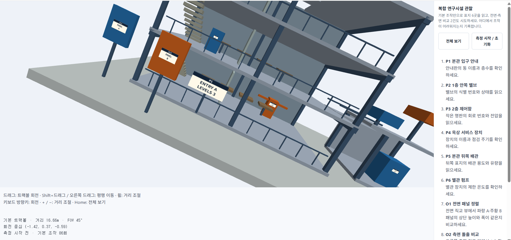
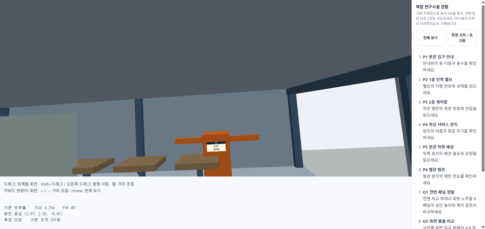
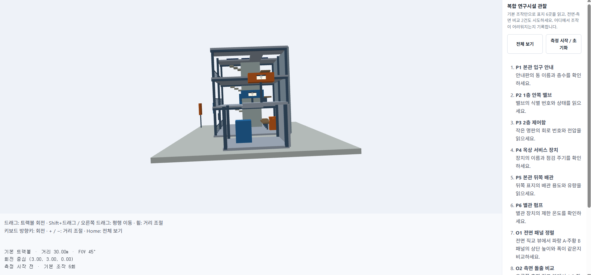

# 4주차 보고서

- 이름 : 김태민
- 저장소 : https://github.com/kimposong/cg-2026-solar/

## 실행 주소와 조작법

- 실행
    - [baseline 실행하기](https://kimposong.github.io/cg-2026-solar/week4/baseline/index.html) 
    - [improved 실행하기](https://kimposong.github.io/cg-2026-solar/week4/improved/index.html)

- improved 조작법
    - 

## 기본 버전의 지점별 관찰 결과와 불편 3개 이상

# 지점별 관찰 결과

| 지점 | 성공 / 실패 | 걸린 시간 | 불필요한 조작·되돌아가기 | 어려웠던 이유 |
| --- | --- | --- | --- | --- |
| P1 | 성공 | 5s | 67회 | 트랙볼 회전 과정에서 글씨를 읽기 위해 좌우로 틀어지지 않고 똑바르게 보기가 어렵다 |
| P2 | 성공 | 10s | 152회 | 1층을 보기 위해서 카메라 레벨을 1층과 같이 맞추는 과정이 어려움 |
| P3 | 성공 | 10s | 318회 | 초기 장면의 거리와 비교하여 읽어야하는 글씨의 크기가 매우 작아 관찰을 하기 위해서 필요이상으로 많은 조작이 들어감 |
| P4 | 성공 | 10s | 242회 | 비교적 편했음 |
| P5 | 성공 | 10s | 115회 | 초기 화면에서 드러나 있지 않아서 어떤 위치에 있는지 알아내는것이 쉽지 않음 |
| P6 | 성공 | 10s | 126회 | 트랙볼의 중심이 본관쪽으로 쏠려 있어서 확대하였을 때 별관 쪽으로 화면의 중심을 옮기는 과정이 번거로움 |
| Q1 | 성공 | 20s | 215회 | 초기 화면에서 두 간판의 높이를 비교하기 위해 정면에서 보는 화면으로의 전환이 쉼지 않음 트랙볼 조절을 세심하게 많은 조작이 필요함 |
| Q2 | 성공 | 20s | 189회 | Q1과 같이 초기 화면에서 측면으로의 화면 전환이 어려움 다수의 조작이 필요했음 |

# 불편사항

- 트랙볼 회전 과정에서 글씨를 읽기 위해 좌우로 틀어지지 않고 똑바르게 보기가 어려움
    - 

- 특정층을 보기 위해서 카메라 레벨을 해당층과 같이 맞추는 과정이 어려움
    - 

- 초기 화면에서 정면 or 정측면으로의 화면 전환이 어려움
    - 

## 사용자·관찰 목표, 대안 2개 이상의 스케치와 비교, 선택·조합한 이유

## 실제 구현한 카메라·투영·입력 방식의 설명과 대표 코드

## 같은 8건에 대한 개선 전후 비교(전면·측면 직교 캡처 포함), 측정 한계, 추가 수정 전후의 기록

## 중요한 Copilot 제안과 본인의 판단 또는 직접 구현한 경우 검토한 대안

